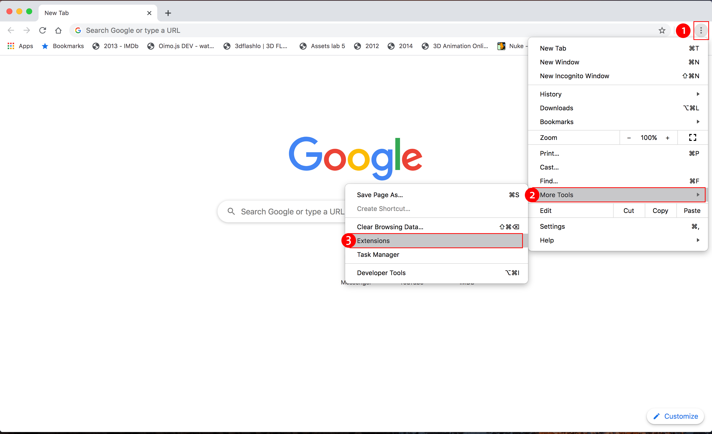
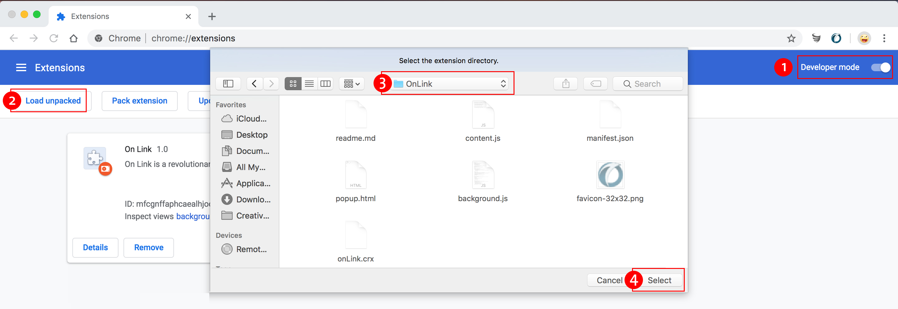
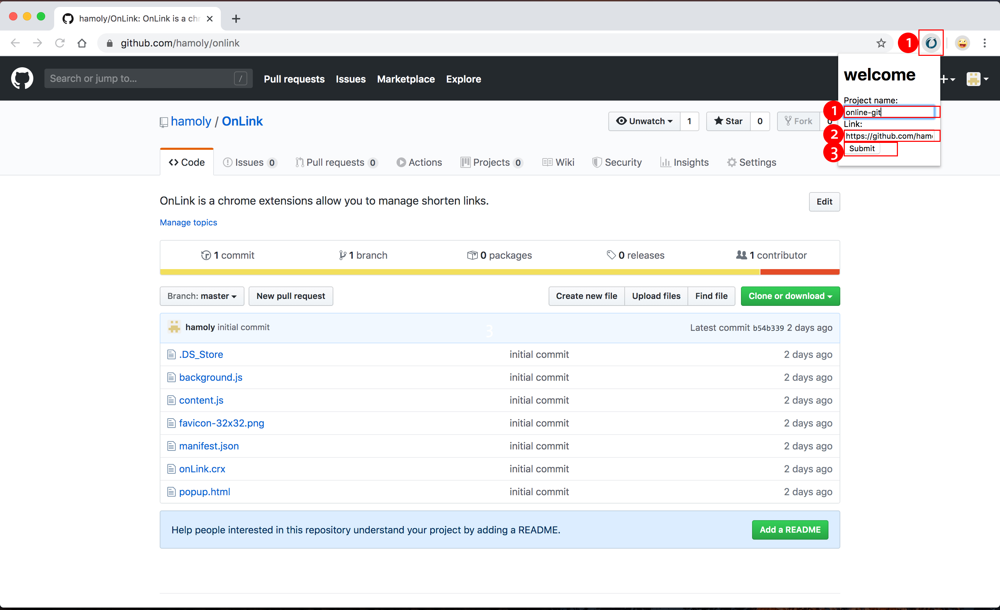

# OnLink
OnLink is a Chrome Extensions allows you to manage and create shorten links by project name. It uses IndexedDB to store data.

# Features
1. Gets the active tab url automatically once you clicked it's icon.
2. Stores the generated link by project name, Original url and the shorten url generated on Adding new link process.
3. Redirects automatically once you enter any shorten url you already added to it's original link.

# Installation
1. Download OnLink repo files.
2. Open google chrome
3. Open chrome://extensions/ or go to Extensions panel by clicking the three dots > More Tools > Extensions.
4. Enable Developer mode from the right top corner.
5. Click Load unpacked from the top left corner then select the OnLink Extension folder you just downloaded.
once it's installed it creates a new IndexedDB database to store your data.

# Usage
1. Click the Extension icon to add new link to the database.
2. Name your project.
3. Add the url you aim to shorten.
4. Type the shorten url generated by the Extension into your chrome browser to be redirected to the original link.

# Contributing
This project welcomes contributions and suggestions.
